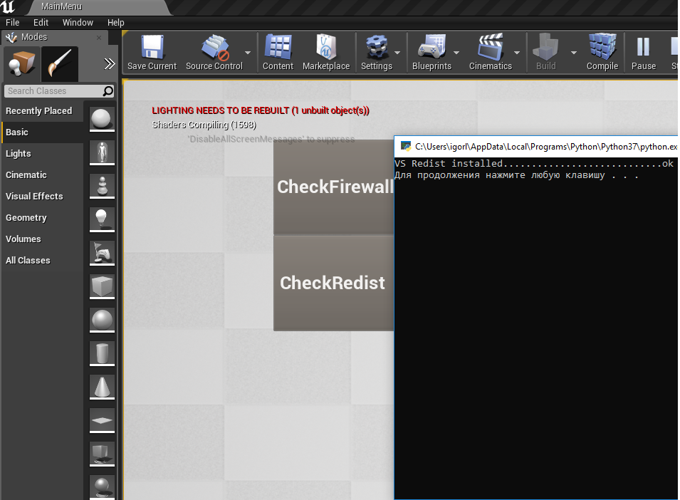

# UE4-Parser
Simple parser python script on UE4. 

You can find main implementation into [https://github.com/yungkee/UE4-Parser/tree/master/MenuParser/Source/MenuOTK/MenuSystem][this].

## Pre-Requisites:
Content->config->(customize your python script located in folder Resource). Python relative import is evil but that`s the case there is no other way.

